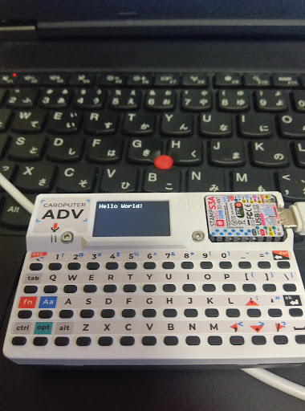

# Hello world LCD

## コンパイル手順
1. arduino IDE 2.3 をインストール
2. arduino IDE 追加のボードマネージャのURLを以下のように設定  
```https://static-cdn.m5stack.com/resource/arduino/package_m5stack_index.json```
3. arduino IDE ツール -> ボードマネージャで`M5Stack`をインストール
4. arduino IDE ツール -> ライブラリを管理... -> `M5Cardputer`をインストール
5. スケッチ -> 検証・コンパイル
6. 書き込み
## 実行結果
[](./assets/helloworld.jpg)