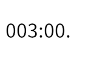

# ラーメンタイマーの実装

## コンパイル手順
1. arduino IDE 2.3 をインストール
2. arduino IDE 追加のボードマネージャのURLを以下のように設定  
```https://static-cdn.m5stack.com/resource/arduino/package_m5stack_index.json```
3. arduino IDE ツール -> ボードマネージャで`M5Stack`をインストール
4. arduino IDE ツール -> ライブラリを管理... -> `M5Cardputer`をインストール
5. スケッチ -> 検証・コンパイル
6. 書き込み

## 仕様
### 画面
#### メイン

- 000:00形式で最大999分59秒まで
- 開始状態は編集可能
    - キャレットがわかるように、反転Orアンダーバー
    - ドットは常に非表示
    - Start to press okをどっかに出す。
- カウントダウン中はカウントダウン
    - ドットは秒毎に点滅
    - カウントダウンキャンセルは初期バージョンでは未対応
- ファンファーレ状態はタイムアウトしたことがわかればOK
~~（000:00のブリンクでいいかな）~~
    なにかキーを押すと開始状態に戻る。
    ファンファーレ鳴らす。仕事が終わったら終了状態に
- 終了状態は表示上はファンファーレ状態と同じ、なにかキーを押すと開始状態に戻る
## 実行結果
https://www.youtube.com/watch?v=R_rDB1ttdtI